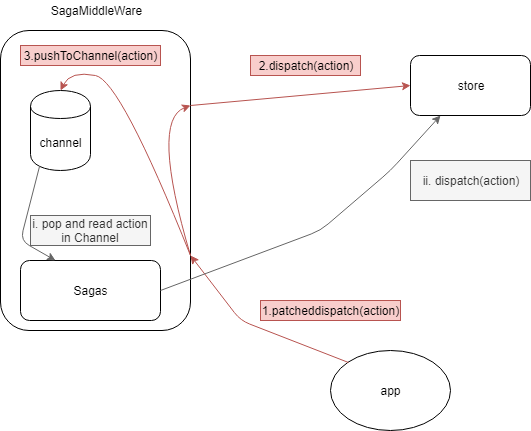

# Integrate Redux-saga into React hooks - Iteration logs

## at Front  
this is a self study project.
More reliable approch to use redux in hook style is already available in [react-redux v7.1.0-alpha.1](https://github.com/reduxjs/react-redux/releases/tag/v7.1.0-alpha.1)

## Credits:  
*list of others' work that should be listed explicitly:*  
* This project is mainly based on this implementation:  
  [experimental useSagaReducer](https://github.com/redux-saga/redux-saga/issues/1692#issuecomment-442765867)

## Iteration 1
**objective:** connect useReducer with redux-saga.  
**overview:**  
Idea comes from redux's official site [middleware#monkeypatch-middleware](https://redux.js.org/advanced/middleware#attempt-3-monkeypatching-dispatch), redux use middleware to utilize the phase between action is fired(* like when user invoked a dispatch function) and is dispatched(* the action is captured by the reducer). middlewares are "functions" that can intercept this phase, access the action object and do something about it, like logging out the action to console.  
**key words:** monkeyPatch, redux middleware  
**links:** [reduxMiddleware#monkeypatch](https://redux.js.org/advanced/middleware#attempt-3-monkeypatching-dispatch)  
**implementation:**  
  


## Iteration 2
**objective:** connect multiple useReducer Together by using redux-saga  
**Overview:**  
Enhancing Iteration 1 by allowing multiple useReducer's to use one SagaMiddleWare. Idea comes from redux's store structure. Redux-store 
allows you to use one store-multiple reducers in multiple UI component. On the other hand, useReducer usually deals with state of one component tree(the 'root' node and its children). Hopefully, by 'namespacing' each useReducer, it is possible to connect two sibling(or far away) useReducers together, let them share saga.  
this implementation only connects sagas, not reducers, meaning the shared part is only on side-effect level, i.e. one reducer dispatch something that should result in side effect of dispatching something else to another reducer, Implement fully connected useReducers(single dispatch is directed to all reducers) is possible, but skeptical to me. also, having fully connected useReducer meaning there is no need to use multiple saga. hmm.. 
**key words:** connecting multiple reducers  
**implementation:**  
To connect useReducers, a key is assigned to each reducer when patched. Apparently on each render, useReducer is Called once, meaning patchStore is also called each time. So it seems proper to put the patch store call after useReducer call, because we need to patch it every time, otherwise the dispatch would just be the plain dispatch freshly returned from useRecuder(.. , ..).  
However, to connect stores together, sage would have to iterate through all connected stores and dispatch actions on each of them. so the problem arise, where and when should you save those stores in a pool? current stategy is to store them upon calling patchStore, like this:    
```javascript
  patchReducerWithSaga({key:'counterSum', store})
```  
reason there is a key property is because...:  
```javascript
  const patchReducerWithSaga = ({key, store}) =>{  
    _.find(stores, {key:key})? _.noop():stores.push({key, store}) 
   ...
  }
```  
The stores are saved in an array, and because patchStore is invoked on each re-render, key is therefore used to avoid pushing 'same' store twice(eventhough old store is discarded from react's mistery storage, evidence can be seen from dispatch being invoked 'once', on the currently existing 'store')  
anthor place this array is used is here:  
```javascript
 const IO = {
  channel,
  dispatch: (actionObj)=>{
    _.forEach(stores, keyedStore=>{
      const dispatch = keyedStore.store[1]
      dispatch(actionObj)
    })
    //dispatch(actionObj) //dispatch to reducer
  }
  ...
 }
```  
here the dispatch property is local to the saga IO, invoked by channel.put, or yield put(...) in saga functions, so on each actions dispatched by saga or react component, an iteration occured to broadcast that action to every store in the array of stores.ONLY store with reducer catching the action would do something about it.  
**note:**  
redux saga is good at implementing 'request'->'side effect'->'dispatch' type of flow. if an action is deemed to dispatched by ui component and reflected directly by reducer, then it probably should be ignored by saga. only use saga to monitor action with side effect. because saga middleware create a copy of the action, dispatch one directly to store, another to saga channel which eventually can be read by take effect.  
todo: verify this behaviour with createSagaMiddleWare


## Iteration 3
**objective:** improvement on iteration 2 a bit more coherent to react's render concept. 
**overview:**  
Enhancing Iteration 2.  
components have ioslated react dispatch, but share the result of saga effect(to be explicit, the 'put' effect).  
I.e. one component's saga can use put effect to dispatch actions to all connected component's reducer.  
**key words:** isolated hook dispatch, shared saga effect  
**steps:**  
Steps to create shared saga with multiple useReducer:  
1. create a sharedChannel object  
2. pass that object as prop to component who will use useReducer and would like to connect to this common channel with some other component.  
3. use customized hook-useSagaReducer  

## Iteration 4
**objective:** itr3 flaw fixes  
**overview:** fix flaws in itr3 implementation and resolves "todo" stated in iteration 1 note/todo  
**notes:**  
besides some minor bugs, there is a major flaw in itr3:
  action sourced from yield put() is only directed to reducer but not to saga channel. this is not coherent to 
  what redux-saga's sagamiddleware do.
It is clear that actions sourced from redux's dispatch is directed to both reducer and saga channel, see following snippet from redux-saga codebase:
```javascript
 function sagaMiddleware({ getState, dispatch }) {
    boundRunSaga = runSaga.bind(null, {
      ...options,
      context,
      channel,
      dispatch,
      getState,
      sagaMonitor,
    })
    return next => action => {
      if (sagaMonitor && sagaMonitor.actionDispatched) {
        sagaMonitor.actionDispatched(action)
      }
      const result = next(action) // hit reducers
      channel.put(action)
      return result
    }
  }
```
from the above snippet, it is inferred that action sourced from yield put() is also dispatched two-way: one to reducer and one to channel.Because argument dispatch is the redux dispatch, and by the time the store is created using createStore(reducer, applyMiddlwares(sagaMiddleware)), actions for sure will go through all middlewares before hitting reducer. And sagaMiddleware takes care of putting the action to channel. 


## Iteration 5  
**objective:** create detached store(conbination of saga and reducer).  
**links:**  
inspired by: [... if we want long-running sagas then we need global state...](https://github.com/redux-saga/redux-saga/issues/1692#issuecomment-462154946)  
issue#3: [detached useSagaReducer](https://github.com/zhaoyingdu/useSagaWithReducer/issues/3#issue-437011863)  
**implementation**:  
put useSagaReducer inside React Context so it can be global. like react-redux, the store object(detail is given later) is passed as a prop to the context Provider. the store object is obtained by a call to `createStore`:
```javascript
const createStore = (reducer, init, saga) => [reducer, init, saga];
const SagaReducerContextProvider = ({ children, store }) => {
  const [state, dispatch] = useSagaReducer(...store);
  return (
    <SagaReducerContext.Provider value={[state, dispatch]}>
      {children}
    </SagaReducerContext.Provider>
  );
};
```
`reducer`, `init`, `saga` can be provided explicitly, this is a mimic to redux and react-redux. purpose is to discover its potential in future.  
*todo:* see if it is possible to drop a Provider component. by passing value directly upon calling React.createContext(...someValue) 

## Iteration 5 
**objective:** fix/update useStore  
**API**:  

createStore(reduxer, initState, ...proxies)  
*params:*  
reducer: same in useReducer
initState: same in useReducer  
proxies: middlewares  
*return:*  
store object that is supposed to be supplied to useStore.  

useStore(store, stateFilter)  
*params:*  
store: object returned from createStore.  
stateFilter: an array of object that is applicable to the state tree of the supplied state to the reducer.  
*return:*  <Array>  
state: state || filtered state  
dispatch: a monkeypatched dispatch, can supply asynchronous/function action[note-1]  
addSubscriber: <Function> add listener on action, triggered on action being dispatched.[note-2], only applicable to STRING||SYMBOL actions, not applicable on function/promise actions.  

**note:**  
1. asynchronous action: {type: Function||Promise, arguments: arguments supplied to the action function}
2. addSubscriber scheme: const unsubscribe = addSubscriber({*ACTIONNAME*: *listener function*}), to unsubcribe, simply invoke unsubscribe()

